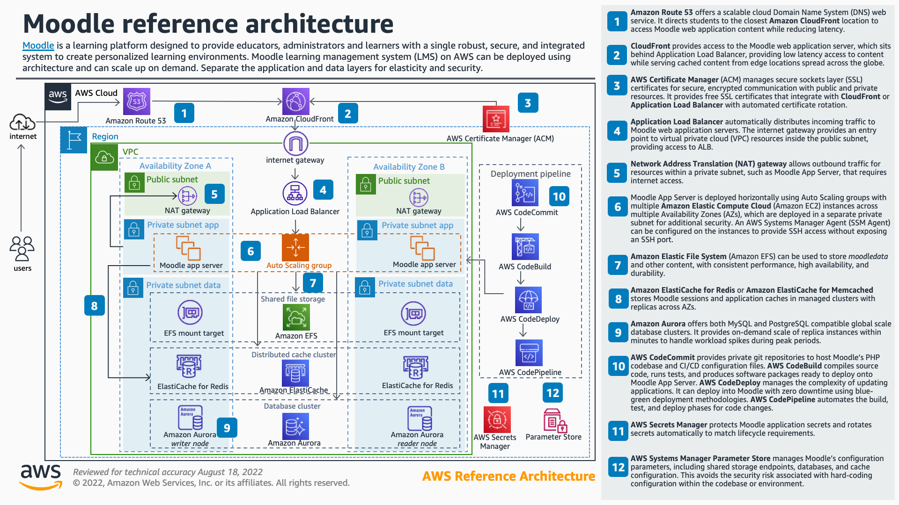
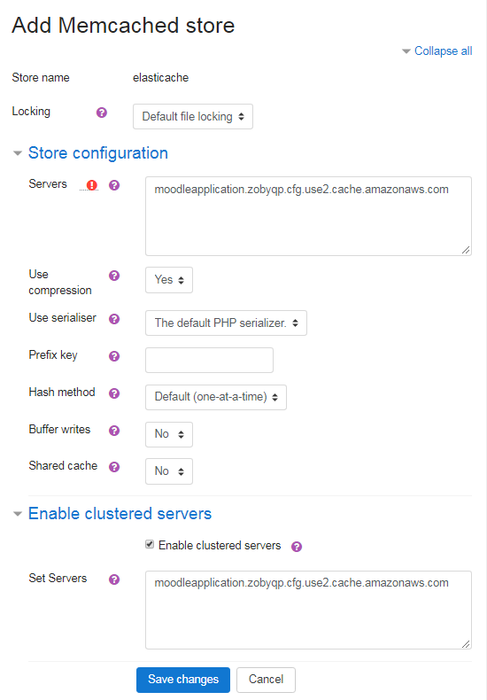

# Hosting Moodle on AWS

### Version 1.0.0

---

© 2018 Amazon Web Services, Inc. and its affiliates. All rights reserved. This work may not be reproduced or redistributed, in whole or in part, without prior written permission from Amazon Web Services, Inc. Commercial copying, lending, or selling is prohibited.

Errors or corrections? Please create an issue and we will repsond to you.

---

## Overview

This repository consists of a set of nested templates which deploy a highly available, elastic, and scalable [Moodle](https://docs.moodle.org) environment on AWS. Moodle is a learning platform designed to provide educators, administrators and learners with a single robust, secure and integrated system to create personalized learning environments. This reference architecture provides a set of YAML templates for deploying Moodle on AWS using [Amazon Virtual Private Cloud (Amazon VPC)](http://docs.aws.amazon.com/AmazonVPC/latest/UserGuide/VPC_Introduction.html), [Amazon Elastic Compute Cloud (Amazon EC2)](http://docs.aws.amazon.com/AWSEC2/latest/UserGuide/concepts.html), [Auto Scaling](http://docs.aws.amazon.com/autoscaling/latest/userguide/WhatIsAutoScaling.html), [Elastic Load Balancing (Application Load Balancer)](http://docs.aws.amazon.com/elasticbalancing/latest/application/introduction.html), [Amazon Relational Database Service (Amazon RDS)](http://docs.aws.amazon.com/AmazonRDS/latest/UserGuide/Welcome.html), [Amazon ElastiCache](http://docs.aws.amazon.com/AmazonElastiCache/latest/UserGuide/WhatIs.html), [Amazon Elastic File System (Amazon EFS)](http://docs.aws.amazon.com/efs/latest/ug/whatisefs.html), [Amazon CloudFront](http://docs.aws.amazon.com/AmazonCloudFront/latest/DeveloperGuide/Introduction.html), [Amazon Route 53](http://docs.aws.amazon.com/Route53/latest/DeveloperGuide/Welcome.html), [Amazon Certificate Manager (Amazon ACM)](http://docs.aws.amazon.com/acm/latest/userguide/acm-overview.html)  with [AWS CloudFormation](http://docs.aws.amazon.com/AWSCloudFormation/latest/UserGuide/Welcome.html). This architecture may be overkill for many Moodle deployments, however the templates can be run individually and/or modified to deploy a subset of the architecture that fits your needs.

## TL;DR

If you just want to deploy the Moodle stack follow these steps. You can read the detail below to better understand the architecture. 

1) If you plan to use TLS, you must create or import your certificate into Amazon Certificate Manager before launching Moodle.
2) Deploy the 00-master.yaml stack. **Do not enable session caching in ElastiCache and leave both the Min and Max Auto Scaling Group (ASG) size set to one.** The installation wizard will not complete if you have session caching configured.
3) After the stack deployment completes, navigate to the web site to complete the Moodle installation. *NOTE: You may encounter a 504 Gateway Timeout or CloudFront error on the final step of the installation wizard (after setting admin password). You can simply refresh the page to complete the installation.*  You may also see "Installation must be finished from the original IP address, sorry." to solve this you will need to update your database and set the lastip field of the mdl_user table to the internal ip address of your ALB (you can find this by looking at the Network Interfaces from the EC2 page in the AWS Console).  From the webserver you can run:
psql -h <hostname> -U<Username> 
update mdl_user set lastip='<ip address>';
4) Configure Application caching in Moodle Site Configuration (see below for details).
5) Now you can update the stack that you just deployed to enable session caching and set the Min and Max Auto Scaling Group size values as desired.

*Note you can reach the webserver by changing the minimum number of bastion hosts to 1 in the Auto Scaling Group or enable Systems Manager Session Manager by updating the IAM role assigned to the webserver instance (https://docs.aws.amazon.com/systems-manager/latest/userguide/session-manager-getting-started-instance-profile.html)

You can launch this CloudFormation stack, using your account, in the following AWS Regions. The template will work in other regions as Aurora PostgreSQL is deployed globally.

| AWS Region Code | Name | Launch |
| --- | --- | --- 
| us-east-1 |US East (N. Virginia)| [](https://console.aws.amazon.com/cloudformation/home?region=us-east-1#/stacks/new?stackName=Moodle&templateURL=https://s3.amazonaws.com/aws-refarch/moodle/latest/templates/00-master.yaml) |
| us-east-2 |US East (Ohio)| [](https://console.aws.amazon.com/cloudformation/home?region=us-east-2#/stacks/new?stackName=Moodle&templateURL=https://s3.amazonaws.com/aws-refarch/moodle/latest/templates/00-master.yaml) |
| us-west-2 |US West (Oregon)| [](https://console.aws.amazon.com/cloudformation/home?region=us-west-2#/stacks/new?stackName=Moodle&templateURL=https://s3.amazonaws.com/aws-refarch/moodle/latest/templates/00-master.yaml) |
| eu-west-1 |EU (Ireland)| [](https://console.aws.amazon.com/cloudformation/home?region=eu-west-1#/stacks/new?stackName=Moodle&templateURL=https://s3.amazonaws.com/aws-refarch/moodle/latest/templates/00-master.yaml) |
| eu-central-1 |EU (Frankfurt)| [](https://console.aws.amazon.com/cloudformation/home?region=eu-central-1#/stacks/new?stackName=Moodle&templateURL=https://s3.amazonaws.com/aws-refarch/moodle/latest/templates/00-master.yaml) |
| ap-southeast-2 |AP (Sydney)| [](https://console.aws.amazon.com/cloudformation/home?region=ap-southeast-2#/stacks/new?stackName=Moodle&templateURL=https://s3.amazonaws.com/aws-refarch/moodle/latest/templates/00-master.yaml) |

## Architecture

The following sections describe the individual components of the architecture. This architecture borrows liberally from the [WordPress Reference Architecture](https://github.com/awslabs/aws-refarch-wordpress). You may want to review that in addition to the discussion below. 



### AWS Certificate Manager

AWS Certificate Manager is a service that lets you easily provision, manage, and deploy Secure Sockets Layer/Transport Layer Security (SSL/TLS) certificates for use with AWS services. You should run SSL/TLS to protect sessions and passwords. If you plan to use Transport Layer Security (TLS), you must create or import a TLS certificate in AWS Certificate Manager before you launching the template. In addition, if you are using CloudFront and hosting Moodle in a region other than us-east-1, you must create or import the certificate in both us-east-1 and the region you are hosting Moodle in. CloudFront always uses certificates from us-east-1.

### Application Load Balancer

An Application Load Balancer distributes incoming application traffic across multiple EC2 instances in multiple Availability Zones. You achieve high availability by clustering multiple Moodle servers behind a load balancer. Moodle provides an overview of [Server Clustering](https://docs.moodle.org/34/en/Server_cluster) that you should review before proceeding. The template will launch an Application Load Balancer (ALB). 

### Amazon Autoscaling

Amazon EC2 Auto Scaling helps you ensure that you have the correct number of Amazon EC2 instances available to handle the load for your application. The template configures autoscaling based on CPU utilization. An additional instance is added when the average CPU utilization exceeds 75% for three minutes and removed when the average CPU utilization is less than 25% for three minutes. Based on the instance type you are running, cache configuration you choose, and other factors, you may find that another metric is a better predictor of load. Feel free to change the metrics as needed. 

*Note that the installation wizard causes spikes in CPU that could cause the cluster to scale unexpectedly. Initially, you should deploy a single server by setting the Min and Max ASG size to one. Then, complete the Moodle configuration wizard, and update CloudFormation stack setting the min and max ASG size to your desired limits.*

### Amazon Elastic File System (EFS)

Amazon Elastic File System (Amazon EFS) provides simple, scalable file storage for use with Amazon EC2 instances in the AWS Cloud. While installing Moodle on EFS would make management (updates, patching, etc.) easier, Moodle does not perform well when run from shared storage. Moodle recommends that dirroot is configured on local storage. Therefore, the template uses a combination of Elastic Block Storage (EBS) and EFS storage. Each web server in the Moodle Cluster employs the following directory structure:
```
$CFG->dirroot = '/var/www/moodle/html'        #Stored on root EBS volume
$CFG->dataroot = '/var/www/moodle/data'       #Stored on shared EFS filesystem
$CFG->cachedir = '/var/www/moodle/cache'      #Stored on shared EFS filesystem
$CFG->tempdir = '/var/www/moodle/temp'        #Stored on shared EFS filesystem
$CFG->localcachedir = '/var/www/moodle/local' #Stored on root EBS volume 
```

Elastic File System throughput scales as the file system grows. Initially EFS will have very little storage. Therefore, the template gives you the option to seed the file system with data to establish baseline performance. In addition, you can monitor the file system performance and add additional data if needed. There is a through discussion of this in the WordPress Reference Architecture. However, because we have chosen to install Moodle on local storage (the WordPress reference architecture installed on EFS) this should be less of a concern that it was for WordPress. 

*Moodle recommends that when running clustered solutions "[dirroot should be always read only for apache process because otherwise built in plugin installation and uninstallation would get the nodes out of sync.](https://docs.moodle.org/34/en/Server_cluster#.24CFG-.3Edirroot)" As this statement implies, you cannot install plugins to a server cluster from the admin page. Moodle recommends manually installing plugins on each server during planned maintenance. To stay true to the infrastructure-as-code methodology employed by CloudFormation, we should script the installation of plugins. Alternatively, you could install the plugin on a single server, create an AMI, and update the Launch Configuration.*

### Caching

Caching can have a dramatic impact on Moodle's performance. The template will configure various forms of caching including OPcache, CloudFront and ElastiCache. 

#### OPcache

Opcache speeds up PHP execution caching precompiled scripts in memory. OPcache benefits are increased performance and significantly lower memory usage. The template configures OPcache as described [here](https://docs.moodle.org/34/en/OPcache).

#### Amazon ElastiCache

Amazon ElastiCache for Memcached is a Memcached-compatible in-memory key-value store service that can be used as a cache or a data store. Moodle recommends that you [don't use the same memcached server for both sessions and MUC. Events triggering MUC caches to be purged leads to MUC purging the memcached server](https://docs.moodle.org/26/en/Session_handling). Therefore, the template configures two elasticache clusters, one for session caching and one for application caching.

##### Session Caching

Moodle recommends that you [store user sessions in one shared memcached server](https://docs.moodle.org/34/en/Server_cluster#Performance_recommendations). The template configures session caching as described [here](https://docs.moodle.org/34/en/Session_handling#Memcached_session_driver). 

*Note: Moodle installation wizard fails if memcached session caching is enabled during the initial configuration. Therefore, you must leave session caching disabled during the initial installation, and then update the template to enable session caching after completing the installation.*

##### Application Caching

The template deploys an ElastiCache cluster for application caching, but the application caching must be configured after launch. You can configure memcache as described [here](https://docs.moodle.org/28/en/Caching#Memcached) filling in the auto-discovery endpoint to the list of Servers under both Store Configuration and Enable Clustered Servers (see image below). You can find the endpoint address in the outputs of the application caching stack. Finally, scroll to the bottom of the caching administration page in Moodle and set elasticache as the default store for application caching. 



#### Amazon CloudFront 

Amazon CloudFront is a global content delivery network (CDN) service that securely delivers data, videos, applications, and APIs to your viewers with low latency and high transfer speeds. The template can optionally configure CloudFront to cache content closer to your users. This is especially beneficial if your users are spread across a large geographic area. For example, remote students in an online program.

### Amazon Route 53

Amazon Route 53 is a highly available and scalable cloud Domain Name System (DNS) web service. The template will optionally configure a Route53 alias that points to either the Application Load Balancer or CloudFront. If you are using another DNS system, you should create a CNAME record in your DNS system to reference either the Application Load Balancer or CloudFront (if deployed). If you don't have access to DNS you can leave Domain Name blank and the template will configure Moodle to use the auto-generated Application Load Balancer domain name. 

## License

This library is licensed under the Apache 2.0 License. 

Portions copyright.

- Moodle is licensed under the General Public License (GPLv3 or later) from the Free Software Foundation.
- OPcache is licensed under PHP License, version 3.01.

Please see LICENSE for applicable license terms and NOTICE for applicable notices.